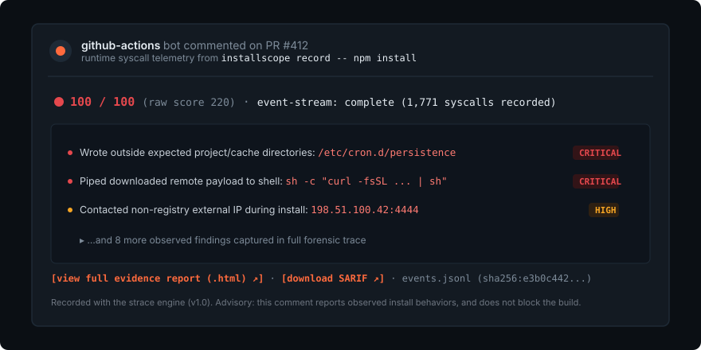

# InstallScope

[](https://github.com/mukti-sys/InstallScope/actions/workflows/rust.yml)
[](https://github.com/mukti-sys/InstallScope/actions/workflows/phase1-e2e.yml)
[](https://github.com/mukti-sys/InstallScope/actions/workflows/phase2-aya.yml)
[](https://github.com/mukti-sys/InstallScope/actions/workflows/harness-tests.yml)

> Attestations verify *who signed* it. InstallScope records *what it did*.

The flight recorder for package installs.

---

<p align="center">
  
</p>

---

## What is InstallScope?

When a pull request adds or updates a dependency, InstallScope captures the **syscall-level ground truth** of what that package's install scripts actually do — filesystem mutations, network sockets, DNS lookups, credential reads, and spawned processes — and posts an austere, single-page forensic report directly to the PR.

Package install scripts (`postinstall`, `preinstall`, `build.rs`) execute arbitrary code with full user privileges. `npm audit` only flags known CVEs against published advisory databases; static scanners inspect ASTs and package manifests before execution; container sandboxes add friction without producing structured review evidence.

InstallScope provides runtime behavioral observation designed specifically for CI pull request reviews.

---

## 3-Command Quickstart

Evaluate an included forensic trace fixture without any Linux or kernel prerequisites:

```bash
# 1. Clone the repository
git clone https://github.com/mukti-sys/InstallScope.git && cd InstallScope

# 2. Evaluate a sample recording against the deterministic rule catalog
cargo run -p installscope -- report corpus/demo/high.jsonl

# 3. Inspect the generated evidence report
cat installscope-report/installscope-comment.md
```

On Linux hosts, record any installation command live:

```bash
installscope record -- npm install
installscope verify events.jsonl
installscope report events.jsonl
```

---

## Landscape

Where InstallScope sits relative to existing tools:

| Category | Tool | CVE Knowledge | Manifest / AST Heuristics | Per-PR Syscall Evidence | Behavioral Version-Diff |
|---|---|---|---|---|---|
| **Advisory Scanners** | `npm audit` / `pip audit` | ✅ Known CVEs | ❌ None | ❌ None | ❌ None |
| **Static Analyzers** | Socket | Partial | ✅ Registry heuristics & AST | ❌ No runtime execution | ❌ Manifest diff only |
| **Runtime Detection** | Falco / Tracee | ❌ By design | ❌ By design | ✅ (Production daemon) | ❌ No PR/install diff |
| **Isolation** | firejail / bubblewrap | ❌ None | ❌ None | ❌ Enforcement primitive | ❌ No review report |
| **Flight Recorder** | **InstallScope** | ❌ Out of scope | ❌ Out of scope | ✅ **Deterministic syscall trace** | ✅ **Content-addressed diff** |

*Note: Falco and Tracee are production runtime monitors for long-running servers and Kubernetes nodes. InstallScope is specifically built for ephemeral CI runners to inspect pull requests before code merges.*

---

## The 840,069 Syscall Experiment

To validate InstallScope at real scale before release, we ran an automated backfill over **50 top npm packages**, recording **250 complete installations** across **200 consecutive version pairs** on ephemeral GitHub Actions runners:

- **100% Completion:** 250 verified recordings, 0 unhandled failures, 0 dropped trace streams.
- **840,069 Total Observations:** 195,780 distinct syscall behaviors reduced to content-addressed profiles.
- **Reproducibility:** Across 20 parallel runner environments, 200 consecutive version comparisons completed with **0 blocked comparisons**.

### What we learned from empirical data:

1. **Network traffic is ubiquitous but static:** In our dataset, 1,023 external network connections and 500 credential reads occurred. Crucially, **none of them differed between versions** of the same package — these were standard registry fetches and local `.npmrc` reads by `npm`.
2. **What actually changes across versions:** Across 200 version transitions, 197 produced purely internal filesystem changes (`node_modules` structure). Only 3 produced new process spawns, all representing legitimate compiler toolchains in native packages (`bcrypt` introducing `node-gyp-build`, `sqlite3` invoking `prebuild-install`, and `protobufjs` invoking `sh`).
3. **The Lesson for PR Review:** Alert fatigue kills security tools. An install contacting `registry.npmjs.org` is normal; an install whose version bump suddenly introduces an unpinned HTTP request to an unknown IP is a surprise. InstallScope's version-diff engine surfaces the difference.

---

## The Behavioral Version-Diff

InstallScope stores recordings in a content-addressed snapshot registry (SHA-256 addresses compressed with `zstd`). When a dependency updates from `v1.2.3` to `v1.2.4`, InstallScope calculates the behavioral diff:

```bash
installscope diff sqlite3 5.1.6 5.1.7
```

Output:
```markdown
# Behavioral Diff: sqlite3 (5.1.6 → 5.1.7)

## Added Behaviors
- `[SPAWN]` /bin/sh -c prebuild-install || node-gyp rebuild
- `[FS_WRITE]` /tmp/sqlite3-binding.node

## Removed Behaviors
- None
```

If a patch release touches no new domains, spawns no new processes, and writes only within `node_modules`, the report states that behavioral profile is identical to the baseline.

---

## GitHub Action Setup

InstallScope uses two separate workflows to maintain a strict security boundary:

1. **`installscope.yml` (`pull_request`)**: Runs on `ubuntu-latest` with a **read-only** token. It executes the package manager, records the syscalls under `strace`, verifies stream integrity, and uploads the evidence artifact.
2. **`installscope-comment.yml` (`workflow_run`)**: Runs only after recording finishes, with write permissions to post the PR comment. It inspects only the uploaded artifact and **never checks out or executes untrusted PR code**.

### 1. Recording Workflow

```yaml
# .github/workflows/installscope.yml
name: installscope
on:
  pull_request:
    paths: ["**/package-lock.json", "**/pnpm-lock.yaml"]

permissions:
  contents: read

jobs:
  record:
    runs-on: ubuntu-latest
    steps:
      - uses: actions/checkout@v4
      - uses: mukti-sys/InstallScope/action/record@v0
        with:
          fail-above: "" # Leave empty for advisory comments; set integer (e.g. 70) to block PR
```

### 2. Comment Posting Workflow

```yaml
# .github/workflows/installscope-comment.yml
name: installscope-comment
on:
  workflow_run:
    workflows: ["installscope"]
    types: [completed]

permissions:
  pull-requests: write
  contents: read

jobs:
  comment:
    runs-on: ubuntu-latest
    if: github.event.workflow_run.conclusion == 'success'
    steps:
      - uses: actions/checkout@v4
      - uses: mukti-sys/InstallScope/action/comment@v0
```

---

## Backend Architecture

InstallScope provides two recording engines evaluated through an automated parity verification suite:

```
                  ┌────────────────────────────────────────┐
                  │          installscope record           │
                  └───────────────────┬────────────────────┘
                                      │
                 ┌────────────────────┴────────────────────┐
                 ▼                                         ▼
   ┌───────────────────────────┐             ┌───────────────────────────┐
   │      strace Backend       │             │     aya eBPF Backend      │
   │          (v1.0)           │             │          (v1.1)           │
   ├───────────────────────────┤             ├───────────────────────────┤
   │ • Default for CI & Action │             │ • In-kernel ring tracing  │
   │ • Zero root privileges    │             │ • 10+ tracepoint probes   │
   │ • Full path resolution    │             │ • Zero tracer overhead    │
   │ • Process tree kill on TO │             │ • Verified in G1 CI gate  │
   └───────────────────────────┘             └───────────────────────────┘
```

- **`strace` (v1.0 - Default)**: Standard engine used by the GitHub Action. Intercepts syscall boundaries with `-f -ff -yy -ttt`. Resolves file descriptors to absolute canonical paths and socket connections to remote IPs. Terminates entire untrusted process trees via dedicated process group signaling (`SIGTERM` → 2s grace → `SIGKILL -<pgid>`).
- **`aya` eBPF (v1.1 - Optional)**: In-kernel tracepoint backend using pure Rust `aya`. Verified continuously in CI (`phase2-aya.yml`) against standard Linux runners.
- **Process Spawn Parity**: `strace` and `aya` hook execution at slightly different kernel boundaries (shebang script execution vs binary interpreter invocation), so cross-backend process spawn parity is classified as best-effort in `parity.rs`.
- **False-Positive Discipline**: Unresolved paths without a determinable parent directory are counted and displayed in reports, but deliberately not scored as outside-zone to avoid manufacturing false critical findings.

---

## The CLI Commands

| Command | Purpose |
|---|---|
| `installscope record -- <cmd>` | Execute and record an install command into `events.jsonl` |
| `installscope verify <file>` | Validate event stream integrity; returns exit code 3 on `PARTIAL` |
| `installscope report <file>` | Score recording against rule catalog → emits SARIF, HTML, and Markdown |
| `installscope lockfile-diff` | Inspect `package-lock.json` or `pnpm-lock.yaml` to detect install script triggers |
| `installscope snapshot push` | Store a verified event stream in the content-addressed registry |
| `installscope snapshot verify` | Re-verify content addresses and hashes of all stored snapshots |
| `installscope diff <pkg> <a> <b>` | Compute behavioral differences between two recorded package versions |
| `installscope parity` | Run parity comparison between `strace` and `aya` trace streams |

---

## Testing & Verification

The test suite enforces zero-warning compliance across all crates:

```bash
# Run unit & integration tests (556 tests)
cargo test --workspace

# Strict clippy linting
cargo clippy --workspace --all-targets -- -D warnings

# Format check
cargo fmt --check

# Run golden test harness (121 checks)
node harness/corpus/test-corpus.mjs
node harness/g2/test-parse.mjs
```

Detailed test logs and verification matrices across host architectures are documented in [TESTS.md](TESTS.md).

---

## Community & Good First Issues

We welcome contributions from systems and security engineers. Three starter issues are ready for community involvement:

1. **Community Rules (`rules/catalog.yaml`):** Add detection for remote script downloads piped to interpreters from unpinned URLs.
2. **Lockfile Support:** Extend `lockfile/` to parse Yarn Berry (v2+) `yarn.lock` formats.
3. **CLI Ergonomics:** Add `--zone-extra <path>` flags to allow maintainers to declare custom build directories.

---

## License

Dual-licensed under either:

- [Apache License, Version 2.0](LICENSE-APACHE)
- [MIT License](LICENSE-MIT)

at your option.
